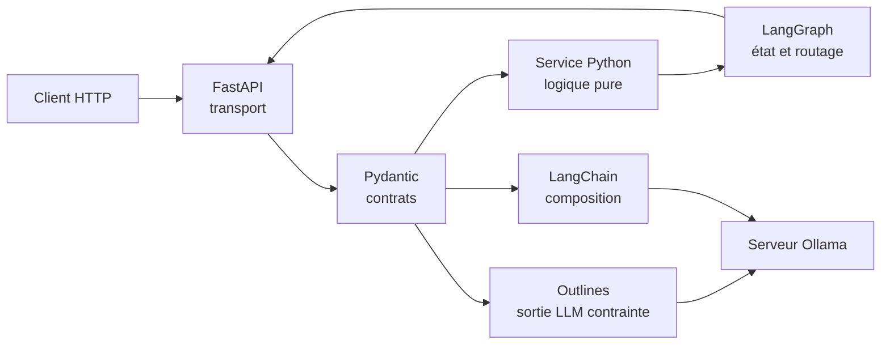

# Assistant d'apprentissage IA — projet intégrateur

## Pourquoi ce projet existe

Une application LLM robuste n'est pas « un prompt dans une route web ». Elle
possède plusieurs frontières qui n'ont pas la même responsabilité : données
entrantes, protocole HTTP, génération probabiliste, composition d'appels et
orchestration d'un état.

Ce projet rend ces frontières visibles avec un cas volontairement petit :

> Recevoir un sujet d'étude, produire un plan structuré, puis décider si
> l'apprenant doit réviser ou progresser selon son score.

Le domaine est simple afin que l'attention reste sur l'architecture.

## Modèle mental



| Technologie | Question à laquelle elle répond | Ce qu'elle ne remplace pas |
|---|---|---|
| Pydantic | « Cette donnée respecte-t-elle notre contrat ? » | La logique métier |
| FastAPI | « Comment exposer ce service via HTTP/OpenAPI ? » | Un worker de tâche longue |
| Outlines | « Comment demander une forme précise au modèle ? » | La validation métier finale |
| LangChain | « Comment composer des composants LLM interchangeables ? » | Le contrôle explicite d'un workflow complexe |
| LangGraph | « Quel nœud exécuter ensuite et quel état conserver ? » | Le modèle ou le protocole HTTP |

## Ordre d'étude

Les chapitres sont conçus pour être suivis dans l'ordre. Chacun indique le code
à lire, une expérience à exécuter et un critère de réussite.

1. [`cours/01-pydantic.md`](cours/01-pydantic.md)
2. [`cours/02-fastapi.md`](cours/02-fastapi.md)
3. [`cours/03-outlines.md`](cours/03-outlines.md)
4. [`cours/04-langchain.md`](cours/04-langchain.md)
5. [`cours/05-langgraph.md`](cours/05-langgraph.md)

Prérequis : annotations de types, classes, fonctions, exceptions, dictionnaires
et notions élémentaires de JSON/HTTP. Les bases Python du dépôt doivent donc
être maîtrisées avant de commencer.

## Organisation des fichiers

```text
02-assistant-apprentissage-ia/
├── cours/                         # cinq chapitres guidés
├── exercices/                     # scripts courts adaptés au débogueur
├── src/study_assistant/
│   ├── schemas.py                 # modèles Pydantic partagés
│   ├── planner.py                 # logique métier pure
│   ├── api.py                     # routes FastAPI
│   ├── outlines_adapter.py        # génération structurée via Ollama
│   ├── chain.py                   # chaînes LangChain offline/Ollama
│   └── workflow.py                # graphe et routage conditionnel
├── tests/                         # tests sans appel réseau
└── pyproject.toml                 # paquet et contraintes de versions
```

Cette disposition `src/` évite qu'un import fonctionne accidentellement
uniquement parce que le terminal se trouve à côté du code. C'est une pratique
plus proche d'un projet Python professionnel qu'une collection de scripts.

## Versions auditées

Audit effectué le 16 août 2026 dans l'environnement Conda `ai_learning` :

| Élément | État avant ajout | Version testée |
|---|---:|---:|
| Python | installé | 3.11.15 |
| Pydantic | installé | 2.13.4 |
| Uvicorn | installé | 0.51.0 |
| FastAPI | absent | 0.141.1 |
| Outlines | absent | 1.3.3 |
| LangChain | absent | 1.3.15 |
| LangGraph | absent | 1.2.11 |
| langchain-ollama | absent | 1.1.0 |
| pytest | absent | 9.1.1 |

Les contraintes dans `pyproject.toml` et `environment.yml` gardent les
frameworks très évolutifs dans les séries mineures testées et empêchent les
changements majeurs, sans figer chaque dépendance transitive.

## Installation du projet d'étude

Pourquoi installer en mode éditable ? Parce que `study_assistant` devient un
vrai paquet importable, tandis qu'une modification sous `src/` reste visible
immédiatement.

Depuis ce dossier :

```powershell
conda activate ai_learning
python -m pip install -e ".[dev]"
```

Ce que la commande fait :

- lit le fichier `pyproject.toml` ;
- vérifie ou installe les dépendances déclarées ;
- enregistre le paquet `study_assistant` en mode éditable ;
- ajoute pytest et HTTPX2 grâce à l'extra `dev`.

## Tests hors ligne

```powershell
python -m pytest
```

Résultat de référence : `16 passed`. Ces tests couvrent :

- données valides, coercition contrôlée et entrées refusées ;
- invariant sur la durée totale du plan ;
- codes HTTP 200, 201 et 422 ;
- normalisation d'une fausse sortie Outlines ;
- composition LangChain sans modèle externe ;
- deux branches du graphe LangGraph.

## Lancer l'API

Pourquoi `--app-dir src` ? Le paquet suit la disposition `src/` et n'a pas
besoin d'être installé pour ce lancement explicite.

```powershell
python -m uvicorn study_assistant.api:app --app-dir src --reload
```

Tu dois voir Uvicorn écouter sur `http://127.0.0.1:8000`. Les interfaces
générées automatiquement sont :

- Swagger UI : `http://127.0.0.1:8000/docs` ;
- schéma OpenAPI JSON : `http://127.0.0.1:8000/openapi.json`.

Exemple PowerShell :

```powershell
$body = @{
    topic = "LangGraph"
    level = "debutant"
    available_minutes = 45
    quiz_score = 82
} | ConvertTo-Json

Invoke-RestMethod `
    -Method Post `
    -Uri http://127.0.0.1:8000/study-workflows `
    -ContentType application/json `
    -Body $body
```

## Appels LLM et sécurité de l'exercice

Les modules `outlines_adapter.py` et `chain.py` connaissent l'adresse par
défaut du laboratoire Ollama : `http://192.168.18.5:11434`. Importer les
modules n'effectue aucun appel réseau. Seules les fonctions
`generate_structured_plan()` avec son générateur par défaut ou une chaîne créée
par `build_ollama_chain()` contactent le serveur.

Cette séparation rend les tests rapides et reproductibles, et évite qu'une
simple découverte de tests consomme des ressources du serveur LLM.

## Définition de « terminé »

Le projet est techniquement prêt lorsque les tests passent. L'étude, elle, est
terminée seulement lorsque tu peux :

- expliquer la responsabilité propre de chacune des cinq bibliothèques ;
- tracer le parcours d'un JSON depuis HTTP jusqu'au workflow ;
- provoquer volontairement une erreur de validation et interpréter son chemin ;
- remplacer la simulation LangChain par Ollama sans modifier le prompt ;
- ajouter une branche LangGraph et son test ;
- justifier pourquoi la sortie d'un LLM reste validée même si elle est
  contrainte par un schéma.
