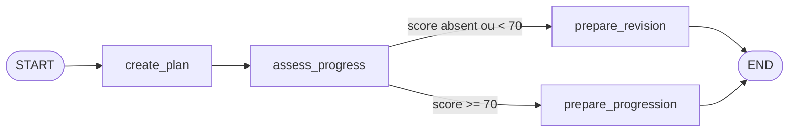

# 05 — LangGraph : orchestrer un état et ses transitions

## Objectif

À la fin de ce chapitre, tu dois pouvoir définir l'état d'un workflow, écrire
des nœuds sans mutation implicite, créer une arête conditionnelle et tester
chaque branche.

Le fichier étudié est `src/study_assistant/workflow.py`.

## Pourquoi un graphe

Une chaîne linéaire convient à une séquence fixe. Un workflow réel peut avoir :

- des branches ;
- des boucles ;
- des étapes parallèles ;
- une reprise après interruption ;
- une intervention humaine ;
- un état persistant.

Un enchevêtrement de `if`, de callbacks et de variables globales peut exprimer
ces comportements, mais rend les transitions difficiles à visualiser et à
tester. LangGraph rend le contrôle explicite.

## Les trois concepts fondamentaux

```text
State : instantané partagé du workflow
Node  : fonction qui lit l'état et retourne une mise à jour
Edge  : transition fixe ou conditionnelle vers le prochain nœud
```

Le workflow du projet est :



## État et réducteurs

`StudyState` est un `TypedDict`. Contrairement à Pydantic, il décrit surtout la
forme pour les outils statiques et LangGraph ; il n'effectue pas à lui seul une
validation récursive à chaque nœud.

Le champ suivant déclare un réducteur :

```python
history: Annotated[list[str], operator.add]
```

Quand un nœud retourne `{"history": ["plan_cree"]}`, LangGraph concatène cette
liste à l'historique existant. Sans réducteur, la nouvelle valeur remplacerait
l'ancienne.

## Pourquoi les nœuds retournent des mises à jour

Un nœud reçoit l'état, mais retourne uniquement les clés modifiées :

```python
def assess_progress(state: StudyState) -> StudyState:
    ...
    return {"decision": decision, "history": ["progression_evaluee"]}
```

Ce modèle réduit les mutations cachées et permet au runtime de fusionner les
mises à jour, y compris lorsque plusieurs nœuds s'exécutent dans un même
super-step.

## Routage et travail

`route_after_assessment()` choisit un nom de nœud mais ne modifie pas l'état.
Les fonctions `prepare_revision()` et `prepare_progression()` font le travail.

Séparer la décision de l'effet rend chaque partie plus simple à tester. Pour un
cas où routage et mise à jour sont intrinsèquement liés, LangGraph fournit aussi
le type `Command`, mais il n'est pas nécessaire dans ce premier graphe.

## Compilation

`builder.compile()` transforme la description en graphe exécutable et réalise
des vérifications structurelles. Le projet compile une fois au chargement du
module, puis réutilise `learning_workflow` pour les invocations.

Une future persistance s'ajouterait à cette frontière de compilation avec un
checkpointer ; elle ne doit pas être simulée par une variable globale maison.

## Expérience

```powershell
python -m pytest tests/test_workflow.py -v
```

Les trois cas couvrent :

- score faible vers `revision` ;
- score élevé vers `progression` ;
- score absent vers la branche sûre `revision`.

Observe ensuite la route FastAPI qui appelle le même graphe :

```powershell
python -m pytest tests/test_api.py::test_workflow_endpoint_exposes_branch_result -v
```

## LangChain ou LangGraph ?

Ce n'est pas un choix exclusif :

- LangChain fournit des composants de modèle, prompt, outil et agent ;
- LangGraph organise le contrôle, l'état et la durée de vie du workflow ;
- un nœud LangGraph peut invoquer une chaîne LangChain ;
- les agents LangChain modernes utilisent eux-mêmes un runtime LangGraph.

Commence par LangChain lorsque l'abstraction de haut niveau suffit. Descends
vers LangGraph lorsque le contrôle explicite du flux devient une exigence.

## Exercice

Ajoute une troisième décision `evaluation_requise` lorsque `quiz_score` est
absent, avec un nouveau nœud `prepare_evaluation`. Mets à jour le type littéral,
la table de routage, le modèle `WorkflowResult` et les tests.

## Critère de réussite

Tu dois pouvoir dessiner le graphe sans regarder le code, expliquer comment
`history` est fusionné et prédire la sortie pour chacun des trois scores :
`None`, `45` et `90`.

## Référence officielle

- [LangGraph — Overview](https://docs.langchain.com/oss/python/langgraph/overview)
- [LangGraph — Graph API](https://docs.langchain.com/oss/python/langgraph/graph-api)
- [LangGraph — Persistence](https://docs.langchain.com/oss/python/langgraph/persistence)
