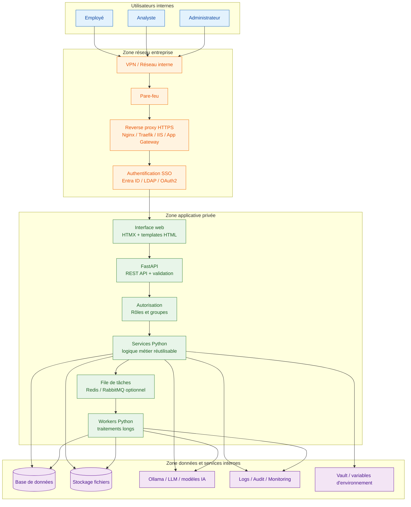

# Choix d’architecture pour le déploiement d’outils internes

> **Positionnement dans le repo**  
> Ce dossier appartient à `09-projets/` parce que le sujet est transversal : architecture applicative, sécurité réseau, déploiement, performance et stratégie d’investissement.  
> Les expérimentations concrètes avec Ollama et la GUI Streamlit demeurent dans :
>
> ```text
> 07-llm/01-ollama-model-tuning/
> ```
>
> Cette séparation est volontaire : `07-llm` sert de laboratoire d’apprentissage LLM, tandis que ce dossier sert à préparer une architecture d’entreprise plus durable.

## Objectif du document

Ce document synthétise l’analyse réalisée autour du choix technologique pour déployer des outils internes sur le réseau de l’entreprise.

L’analyse partait initialement d’une comparaison entre **Streamlit** et un **GUI desktop classique**, mais la réflexion a évolué vers une question plus stratégique :

> Quel investissement technologique permet de construire des outils internes sécurisés, performants, faciles à déployer et capables d’évoluer sans devoir être réécrits ?

La conclusion principale est que **Streamlit peut être utile pour prototyper**, mais ne devrait pas être choisi comme fondation principale si l’objectif est de bâtir une plateforme durable d’outils internes.

---

## Résumé exécutif

Pour un besoin d’entreprise où les priorités sont :

- l’évolutivité fonctionnelle ;
- la sécurité réseau démontrable ;
- la performance ;
- le déploiement standardisé ;
- la capacité de faire évoluer l’interface sans réécrire toute l’application ;
- la compatibilité avec des outils Python, IA, LLM ou automatisation ;

le meilleur investissement recommandé est :

```text
FastAPI + HTMX au départ
```

avec une possibilité d’évolution vers :

```text
FastAPI + React / Vue / Angular
```

si l’interface utilisateur devient plus complexe.

L’idée centrale est de ne pas investir dans un outil d’interface qui enferme la logique métier, mais plutôt dans une **architecture web standard**, composée de :

- une interface web ;
- une API backend ;
- des services Python réutilisables ;
- une couche de sécurité réseau ;
- un déploiement conteneurisé ;
- des workers pour les traitements longs ;
- une journalisation et une observabilité adaptées à un contexte d’entreprise.

---

## Pourquoi ne pas choisir Streamlit comme fondation principale ?

Streamlit est un très bon outil pour certains cas précis :

- prototypes rapides ;
- démonstrateurs IA ou data ;
- dashboards simples ;
- outils utilisés par une petite équipe ;
- interfaces rapides autour de scripts Python.

Cependant, Streamlit devient moins approprié lorsque l’objectif est de construire une application interne durable.

### Limitations principales de Streamlit

| Limitation | Impact potentiel |
|---|---|
| Contrôle limité de l’architecture web | Difficile de structurer une application complexe |
| Authentification et autorisation avancées non natives | Sécurité plus difficile à prouver sans infrastructure autour |
| Mélange fréquent UI + logique métier | Maintenance plus difficile à long terme |
| Modèle d’exécution par réexécution du script | Peut compliquer la performance et la gestion d’état |
| Contrôle limité de l’interface | Risque de blocage si l’UX devient complexe |
| Moins adapté aux workflows métier longs | Peut forcer une migration ultérieure |
| Moins naturel pour une API réutilisable | Difficile de servir plusieurs clients ou intégrations |

Le risque principal est de commencer rapidement avec Streamlit, puis de devoir refaire l’application lorsque les besoins augmentent : rôles, audit, sécurité, performance, API, intégrations, interface plus riche, etc.

---

## Clarification : le vrai choix n’est pas Streamlit vs GUI

Le choix initial semblait être :

```text
Streamlit vs GUI desktop
```

Mais ce n’est pas la bonne façon de cadrer la décision.

Le vrai choix est plutôt :

```text
Prototype rapide vs application interne durable
```

ou encore :

```text
Outil UI spécialisé vs architecture web standard
```

Plusieurs outils permettent d’afficher une interface dans le navigateur :

- Streamlit ;
- Gradio ;
- Dash ;
- Panel ;
- NiceGUI ;
- Reflex ;
- FastAPI + HTMX ;
- FastAPI + React/Vue ;
- Django ;
- ASP.NET Core.

La conclusion est que les outils comme Streamlit, Gradio ou NiceGUI peuvent être intéressants pour accélérer un prototype, mais ils sont moins stratégiques qu’une architecture basée sur une API backend claire.

---

## Orientation d’investissement recommandée

### Investir dans une architecture, pas seulement dans un outil d’interface

L’investissement recommandé est de construire une base applicative durable :

```text
Frontend léger ou moderne
        |
        v
API FastAPI
        |
        v
Services Python réutilisables
        |
        v
Modèles, bases de données, fichiers, APIs internes
```

Cette approche permet de protéger l’investissement, car l’interface peut changer sans que toute la logique métier doive être réécrite.

Par exemple, on peut commencer avec :

```text
FastAPI + HTMX
```

puis évoluer vers :

```text
FastAPI + React
```

sans jeter le backend, les services Python, les règles de sécurité ou les intégrations.

---

## Choix recommandé : FastAPI + HTMX

### Pourquoi FastAPI ?

FastAPI est un framework Python moderne pour construire des APIs web performantes.

Il est pertinent ici parce qu’il permet de :

- rester dans l’écosystème Python ;
- exposer une REST API propre ;
- séparer l’interface de la logique métier ;
- valider les entrées avec Pydantic ;
- documenter automatiquement les endpoints ;
- intégrer facilement l’authentification ;
- déployer avec Docker ;
- supporter des appels synchrones ou asynchrones ;
- intégrer des workers pour les tâches longues ;
- réutiliser les services depuis plusieurs interfaces.

### Pourquoi HTMX ?

HTMX permet de créer des interfaces web interactives sans construire immédiatement une application frontend complexe avec React ou Vue.

Il permet au navigateur de demander des fragments HTML au serveur, ce qui donne une expérience dynamique tout en gardant une architecture simple.

Ce choix est particulièrement adapté pour :

- outils internes ;
- formulaires ;
- tableaux ;
- pages administratives ;
- workflows simples à moyens ;
- équipes principalement Python ;
- déploiement rapide mais propre.

### Pourquoi ce choix protège l’investissement ?

Parce que la partie importante devient le backend et les services métier, pas l’interface.

Si l’interface HTMX devient insuffisante, on peut ajouter React ou Vue plus tard sans réécrire :

- les routes API ;
- la logique métier ;
- les services Python ;
- les connexions aux modèles ;
- la couche sécurité ;
- les tests backend ;
- la structure de déploiement.

---

## Qu’est-ce qu’une REST API dans cette architecture ?

Une REST API est une interface réseau standard qui permet à une application de demander au serveur de lire des données ou d’exécuter des actions.

Exemple pour un outil interne de comparaison de modèles LLM :

```text
POST /api/compare-models
```

Avec une requête :

```json
{
  "prompt": "Explique-moi la régression linéaire",
  "model_a": "llama3",
  "model_b": "mistral"
}
```

Et une réponse :

```json
{
  "model_a_response": "La régression linéaire est...",
  "model_b_response": "Une régression linéaire permet de...",
  "duration_seconds": 4.2
}
```

La REST API devient donc un point de contrôle clair entre l’interface utilisateur et les systèmes internes.

---

## Architecture cible recommandée



---

## Sécurité réseau démontrable

Cette architecture facilite la preuve de sécurité, car les responsabilités sont séparées.

### Contrôles réseau

- accès uniquement depuis le réseau interne ou via VPN ;
- exposition publique limitée au reverse proxy ;
- port exposé principal : `443` en HTTPS ;
- backend FastAPI non exposé directement aux utilisateurs ;
- base de données non accessible depuis les postes utilisateurs ;
- segmentation entre utilisateurs, application et données ;
- pare-feu entre les zones ;
- possibilité d’ajouter un WAF ou une passerelle applicative.

### Contrôles d’authentification

- intégration SSO possible avec Entra ID, LDAP ou OAuth2 ;
- authentification centralisée ;
- MFA possible selon les politiques de l’entreprise ;
- sessions expirables ;
- gestion par groupes.

### Contrôles d’autorisation

- rôles applicatifs ;
- permissions par endpoint ;
- séparation utilisateur / administrateur ;
- validation côté serveur ;
- audit des actions sensibles.

### Contrôles applicatifs

- validation des entrées avec Pydantic ;
- limites de taille pour uploads ;
- rate limiting possible ;
- timeouts ;
- gestion sécurisée des secrets ;
- logs structurés ;
- monitoring des erreurs ;
- tests automatisés ;
- images Docker minimales et reproductibles.

---

## Performance

FastAPI est performant pour les appels web et permet de bien séparer les tâches courtes et longues.

### Tâches courtes

```text
Navigateur -> FastAPI -> Services Python -> Réponse immédiate
```

### Tâches longues

Pour les traitements longs, comme la comparaison de modèles LLM, l’approche recommandée est :

```text
Navigateur -> FastAPI -> File de tâches -> Worker -> Résultat
```

Cela permet de contrôler :

- la concurrence ;
- les timeouts ;
- la consommation mémoire ;
- les accès GPU ou CPU ;
- les files d’attente ;
- les erreurs ;
- les reprises ;
- la journalisation.

---

## Déploiement recommandé

Le déploiement devrait être standardisé avec Docker.

### Structure de projet proposée

```text
internal-tools-platform/
├── app/
│   ├── main.py
│   ├── routes/
│   │   ├── web.py
│   │   └── api.py
│   ├── services/
│   │   ├── model_compare.py
│   │   └── security.py
│   ├── templates/
│   │   ├── base.html
│   │   └── compare.html
│   ├── static/
│   │   └── styles.css
│   └── workers/
│       └── tasks.py
├── tests/
├── Dockerfile
├── docker-compose.yml
├── requirements.txt
├── .env.example
└── README.md
```

### Déploiement cible

```text
Docker container FastAPI
        |
        v
Reverse proxy HTTPS
        |
        v
Réseau interne / VPN / SSO
```

Cette approche est compatible avec :

- VM interne ;
- Docker Compose ;
- Kubernetes ;
- Azure Container Apps ;
- Azure App Service ;
- OpenShift ;
- IIS reverse proxy ;
- Nginx ou Traefik.

---

## Comparaison des options

| Option | Avantages | Limites | Recommandation |
|---|---|---|---|
| Streamlit | Très rapide, simple, excellent prototype | Limité pour sécurité, architecture, UX avancée | À utiliser pour preuve de concept seulement |
| Gradio | Très bon pour LLM/chatbot/démos IA | Moins adapté aux apps métier durables | Bon pour prototypes IA |
| Dash | Solide pour dashboards analytiques | Plus verbeux, moins généraliste | Bon pour BI/data apps |
| NiceGUI | Plus flexible que Streamlit, Python friendly | Moins standard entreprise | Possible pour outil interne moyen |
| FastAPI + HTMX | Durable, simple, sécurisable, performant | Plus de structure à mettre en place | Recommandé comme investissement principal |
| FastAPI + React/Vue | Très évolutif, UX riche | Plus complexe | Recommandé si interface complexe prévue |
| GUI desktop | Intégration locale forte | Déploiement et mises à jour plus lourds | À réserver aux besoins desktop spécifiques |

---

## Décision recommandée

La recommandation finale est :

> Investir dans une architecture **FastAPI + HTMX + Docker + reverse proxy HTTPS**, avec une séparation claire entre interface, API, logique métier, sécurité et traitements longs.

Cette orientation permet de :

- déployer facilement sur le réseau de l’entreprise ;
- prouver la sécurité réseau ;
- maintenir une bonne performance ;
- éviter l’enfermement dans un outil UI limité ;
- faire évoluer l’interface sans réécrire le backend ;
- réutiliser les services Python ;
- supporter des usages IA/LLM, automatisation, données et outils métier.

---

## Stratégie progressive proposée

### Phase 1 — Fondation

- créer une application FastAPI minimale ;
- ajouter HTMX pour l’interface ;
- créer une première route API ;
- isoler la logique métier dans des services Python ;
- préparer Docker ;
- documenter les flux réseau.

### Phase 2 — Sécurité et déploiement

- ajouter reverse proxy HTTPS ;
- restreindre l’accès au réseau interne ou VPN ;
- intégrer SSO ou authentification d’entreprise ;
- ajouter logs et audit ;
- gérer les secrets hors du code ;
- définir les rôles utilisateurs.

### Phase 3 — Performance et industrialisation

- ajouter workers pour tâches longues ;
- ajouter file de tâches si nécessaire ;
- ajouter monitoring ;
- ajouter tests automatisés ;
- standardiser le template pour plusieurs outils internes.

### Phase 4 — Évolution UI si nécessaire

- conserver FastAPI et les services Python ;
- remplacer ou compléter HTMX avec React/Vue si les besoins UX deviennent plus avancés ;
- exposer les mêmes APIs à plusieurs clients.

---

## Conclusion

Streamlit reste utile pour explorer rapidement une idée, mais il ne correspond pas au meilleur investissement si l’objectif est de construire une base durable pour des outils internes d’entreprise.

L’investissement le plus stratégique est de bâtir une architecture web standard :

```text
FastAPI + HTMX + Docker + Reverse Proxy HTTPS + Services Python
```

Cette approche répond mieux aux critères exprimés :

- moins de limitations à long terme ;
- meilleure sécurité réseau démontrable ;
- déploiement plus standard ;
- performance plus contrôlable ;
- meilleure séparation des responsabilités ;
- possibilité d’évoluer vers un frontend moderne sans réécrire toute l’application.
